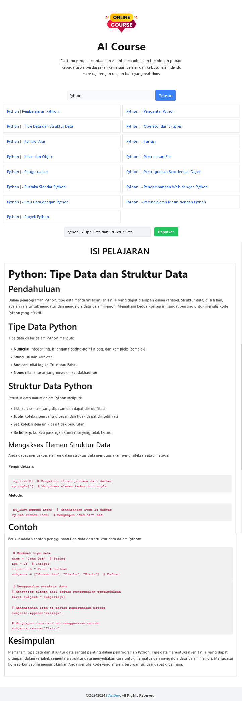

# Aplikasi Berbasis WEB AI Course | Asisten Pengajaran Otomatis

## Latar Belakang

Dengan kemajuan teknologi dan perkembangan pesat dalam bidang kecerdasan buatan (AI), kebutuhan akan alat yang dapat mempermudah proses pembelajaran semakin meningkat. Aplikasi berbasis web yang dirancang sebagai Asisten Pengajaran Otomatis ini bertujuan untuk menyediakan sumber daya pembelajaran yang relevan dan efisien dengan memanfaatkan kemampuan AI dalam menghasilkan konten pendidikan. Dengan mengintegrasikan teknologi pencarian dan pengolahan teks, aplikasi ini diharapkan dapat meningkatkan pengalaman belajar bagi pengguna.

## Rumusan Masalah

- Bagaimana cara mengembangkan aplikasi berbasis web yang mampu menghasilkan rekomendasi judul pembelajaran menggunakan kecerdasan buatan?
- Bagaimana cara aplikasi ini dapat menyediakan konten pembelajaran yang relevan berdasarkan input dari pengguna?
- Apa saja tantangan yang dihadapi dalam implementasi sistem dan bagaimana solusinya?

## Tujuan Penelitian

- Mengembangkan aplikasi berbasis web yang dapat menghasilkan daftar judul pembelajaran secara otomatis menggunakan API AI.
- Menyediakan konten pembelajaran yang lengkap dan terstruktur dengan baik berdasarkan judul yang dipilih oleh pengguna.
- Menganalisis efektivitas aplikasi dalam membantu pengguna menemukan materi pembelajaran yang sesuai.

## Metodologi

### 1. Desain dan Pengembangan

- **Penggunaan Framework**: Aplikasi ini dibangun menggunakan Node.js dan Express untuk backend, yang memungkinkan pengelolaan rute dan middleware secara efisien. Data disimpan dalam format JSON.
- **Integrasi API AI**: Menggunakan API Gemini untuk menghasilkan rekomendasi judul dan konten pembelajaran. Permintaan ke API dilakukan menggunakan axios.
- **Database Lokal**: Data kursus dan query disimpan dalam `database.json`, yang memungkinkan akses dan penyimpanan yang mudah.

### 2. Implementasi Fitur

- **Pencarian Judul Kursus**: Mengimplementasikan endpoint /search-course untuk menerima query dari pengguna dan memberikan rekomendasi judul yang relevan.
- **Generasi Konten**: Endpoint /generate-content digunakan untuk menghasilkan artikel pembelajaran berdasarkan judul yang dipilih pengguna.
- **Pengolahan Data**: Penggunaan algoritma Levenshtein untuk menemukan kecocokan judul yang mendekati untuk menghindari duplikasi konten.

### 3. Pengujian

- Melakukan pengujian terhadap fungsionalitas aplikasi untuk memastikan bahwa rekomendasi judul dan konten yang dihasilkan relevan dan akurat.
- Mengumpulkan umpan balik dari pengguna untuk evaluasi dan perbaikan lebih lanjut.

## Hasil dan Pembahasan

Aplikasi ini berhasil menyediakan daftar judul pembelajaran secara otomatis dan memungkinkan pengguna untuk mendapatkan konten yang terstruktur dengan baik. Analisis hasil menunjukkan bahwa pengguna merasa lebih terbantu dalam menemukan materi pembelajaran yang sesuai dengan kebutuhan mereka. Tantangan yang dihadapi termasuk validasi data dan pengelolaan respons API yang tidak selalu konsisten.

## Kesimpulan

**Aplikasi Berbasis WEB AI Course | Asisten Pengajaran Otomatis** ini menunjukkan potensi besar dalam meningkatkan pengalaman pembelajaran melalui teknologi. Dengan kemampuan untuk menghasilkan judul dan konten secara otomatis, aplikasi ini dapat menjadi alat yang efektif bagi siswa dan pengajar. Penelitian lebih lanjut diperlukan untuk meningkatkan algoritma pencarian dan pengolahan konten agar lebih responsif terhadap kebutuhan pengguna.

### Langkah-langkah Instalasi

Clone Repositori Buka terminal dan jalankan perintah berikut untuk mengkloning repositori:

```bash
git clone https://github.com/fitri-hy/course-ai-nodejs.git
```

Navigasi ke Direktori Proyek Setelah kloning selesai, navigasikan ke direktori proyek:

```bash
cd course-ai-nodejs
```

Instal Dependensi Jalankan perintah berikut untuk menginstal semua dependensi yang diperlukan:

```bash
npm install
```

Konfigurasi API yang disediakan (`.env`). Kami menggunakan Gemini AI.

```bash
API_KEY=AIzxxxxxxxxxxxxx
```

Menjalankan Aplikasi Setelah semua dependensi terinstal dan konfigurasi lingkungan telah disiapkan, Anda dapat menjalankan aplikasi dengan perintah berikut:

```bash
npm start
```

