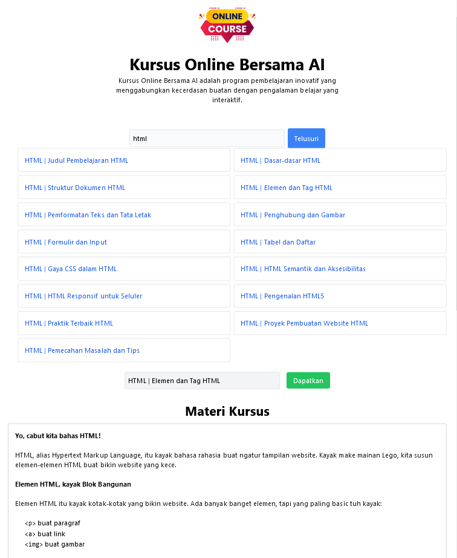

# Aplikasi Berbasis WEB AI Course | Asisten Pengajaran Otomatis

## I. Pendahuluan

Dalam era digital saat ini, pendidikan telah mengalami transformasi yang signifikan. Meskipun akses terhadap informasi semakin mudah, banyak individu yang masih menghadapi kesulitan dalam menemukan materi pembelajaran yang relevan dan berkualitas. Oleh karena itu, kami, sekelompok penggemar teknologi dan pendidikan, merasa terdorong untuk menciptakan solusi yang dapat membantu pengguna dalam proses belajar mereka. Melalui skripsi ini, kami akan menjelaskan awal mula hingga terciptanya aplikasi **AI Course | Asisten Pengajaran Otomatis**, sebuah Aplikasi web pembelajaran yang memanfaatkan teknologi AI untuk memberikan pengalaman belajar yang lebih efektif dan efisien.

## II. Latar Belakang

Sebelum pengembangan **AI Course | Asisten Pengajaran Otomatis**, kami mengamati bahwa banyak orang ingin meningkatkan pengetahuan mereka tetapi seringkali merasa kewalahan oleh banyaknya informasi yang tersedia di internet. Proses pencarian materi pembelajaran yang sesuai dengan kebutuhan sering kali memakan waktu dan membingungkan. Dalam konteks inilah, muncul ide untuk memanfaatkan teknologi AI guna membantu pengguna menemukan dan menghasilkan konten pembelajaran secara otomatis.

## III. Momen Pencerahan

Suatu malam, dalam sebuah diskusi, salah satu anggota tim kami mengemukakan ide inovatif:

"*Bagaimana jika kita menggunakan teknologi AI untuk membantu orang menemukan dan menghasilkan konten pembelajaran?*"

Ide ini menginspirasi kami untuk mengeksplorasi lebih lanjut tentang bagaimana teknologi dapat diintegrasikan ke dalam proses pembelajaran.

## IV. Proses Pengembangan

Setelah momen pencerahan tersebut, kami mulai bekerja dengan semangat dan antusiasme. Kami melakukan riset mendalam mengenai AI dan kemampuannya dalam menghasilkan konten. Dengan mengumpulkan data dan membangun database judul kursus, kami mengembangkan algoritma untuk mencocokkan kueri pengguna dengan konten yang relevan.

Selama beberapa bulan, kami menghadapi berbagai tantangan teknis, tetapi komitmen kami untuk menyelesaikan aplikasi ini tidak surut. Kami terus melakukan perbaikan, menguji fitur-fitur baru, dan mendengarkan masukan dari calon pengguna. Setiap umpan balik yang kami terima membawa kami lebih dekat ke visi kami untuk menciptakan platform pembelajaran yang intuitif dan efisien.

## V. Peluncuran Pertama

Setelah peluncuran, kami sangat senang melihat tanggapan positif dari pengguna. Mereka mulai merasakan manfaat dari fitur pencarian judul otomatis dan generasi konten yang cepat. Kami terus berkomitmen untuk mengembangkan aplikasi ini, menambahkan fitur baru, dan meningkatkan pengalaman pengguna berdasarkan umpan balik yang kami terima.

## VII. Visi ke Depan

Kami bertekad untuk terus berinovasi, mengadaptasi teknologi terbaru, dan memberikan yang terbaik bagi pengguna kami. Kami percaya bahwa pendidikan seharusnya tidak memiliki batasan, dan kami berkomitmen untuk menjadi bagian dari perjalanan pembelajaran Anda.

## VIII. Kesimpulan

Melalui **AI Course | Asisten Pengajaran Otomatis**, kami berharap dapat mengubah cara orang belajar dan berinteraksi dengan informasi yang akurat dan relavan. Dengan memanfaatkan teknologi AI, kami berkomitmen untuk memberikan pengalaman belajar yang lebih cerdas, cepat, dan efisien. Kami mengajak Anda untuk bergabung dalam revolusi pembelajaran ini dan menjadi bagian dari komunitas **AI Course | Asisten Pengajaran Otomatis**. Bersama, kita bisa menciptakan masa depan yang lebih cerah melalui pendidikan.

# Penginstalan

### Prasyarat

Sebelum memulai, pastikan Anda telah memenuhi prasyarat berikut:

- Node.js: Pastikan Anda telah menginstal Node.js.
- Git: Pastikan Anda memiliki Git terinstal di sistem Anda.

### Langkah-langkah Instalasi

Clone Repositori Buka terminal dan jalankan perintah berikut untuk mengkloning repositori:

```bash
git clone https://github.com/fitri-hy/course-ai-nodejs.git
```

Navigasi ke Direktori Proyek Setelah kloning selesai, navigasikan ke direktori proyek:

```bash
cd course-ai-nodejs
```

Instal Dependensi Jalankan perintah berikut untuk menginstal semua dependensi yang diperlukan:

```bash
npm install
```

Konfigurasi API yang disediakan (`.env`). Kami menggunakan Gemini AI.

```bash
API_KEY=AIzxxxxxxxxxxxxx
```

Menjalankan Aplikasi Setelah semua dependensi terinstal dan konfigurasi lingkungan telah disiapkan, Anda dapat menjalankan aplikasi dengan perintah berikut:

```bash
npm start
```